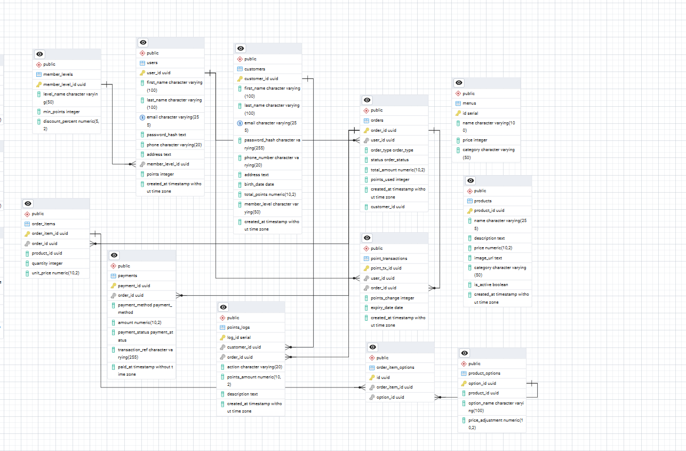
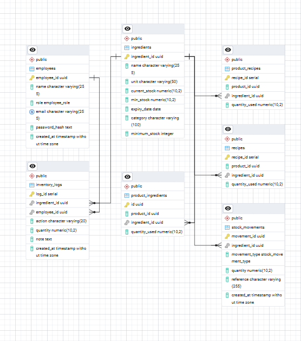
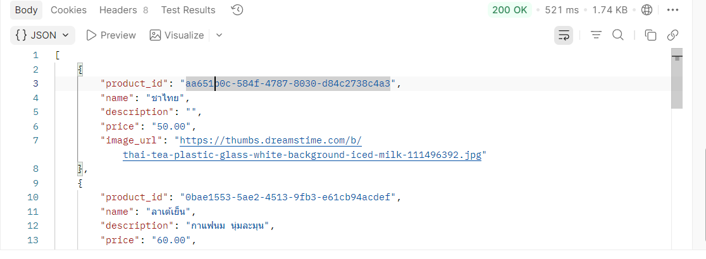
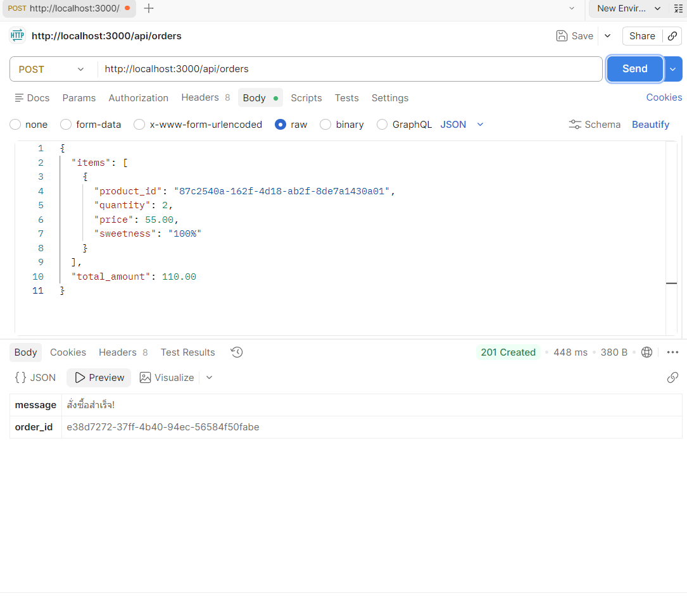
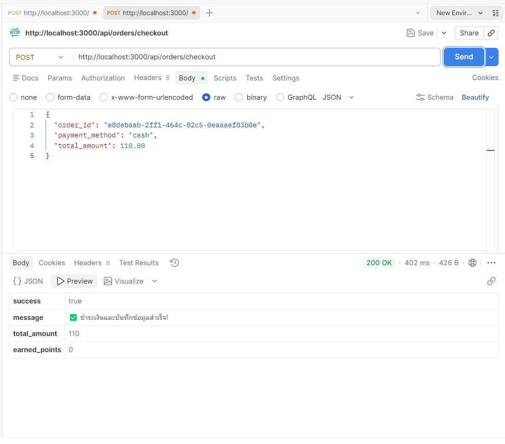

# Coffee Shop Management System

ระบบบริหารจัดการร้านกาแฟแบบครบวงจร ตั้งแต่หน้าการเลือกเมนูสำหรับลูกค้า ไปจนถึงระบบหลังบ้านสำหรับบาริสต้าและการจัดการแต้มสะสม

---

## 1. ทีมงานและขอบเขตความรับผิดชอบ

* **นางสาวสุพิชญา สงวนโอษฐ** - หน้า Customer (ฝั่งลูกค้า)
  * **รับผิดชอบ:** หน้าเมนูสินค้า, ตะกร้าสินค้า, สมัครสมาชิก / Login, หน้าติดตามสถานะออเดอร์, หน้าจัดการสต็อก
* **นางสาวสุรีมนต์ วงศ์พระราม** - หน้า POS / Dashboard / Stock
  * **รับผิดชอบ:** หน้าเพิ่ม/แก้ไขสินค้า, หน้า Dashboard, รายงานยอดขาย, หน้าจัดการสต็อก
* **นางสาวอริชนัน ประวันจะ** - API & Authentication
  * **รับผิดชอบ:** ระบบ Login / JWT, ระบบสิทธิ์ (Admin / Employee / Customer), เชื่อมฐานข้อมูล, CRUD สมาชิก
* **นางสาวสุณัฐชา แก้วลา** - Order & Payment Logic
  * **รับผิดชอบ:** ระบบสั่งซื้อ, คำนวณราคา, ตัดสต็อก, เชื่อม Payment Gateway, ระบบคืนเงิน (Refund)
* **นายเสกสรรค์ ผคุโนภาส** - Database + Deployment
  * **รับผิดชอบ:** ออกแบบ ER Diagram, สร้างตารางฐานข้อมูล, เขียน SQL, จัดการ Hosting / Server, ตั้งค่า HTTPS, Backup Database
* **นางสาววณิชชา จับปรั่ง** - Tester + Integrator
  * **รับผิดชอบ:** ทดสอบระบบ (Test Case), ตรวจสอบ Error, เชื่อม Frontend กับ Backend, จัดทำ Demo / Presentation

---

## 2. System Requirements Specification (SRS)
**ขอบเขตระบบทั้งหมดและส่วนที่พัฒนา:**
* ระบบแสดงรายการสินค้าแยกตามหมวดหมู่ (พัฒนาเสร็จสิ้น)
* ระบบตะกร้าสินค้าและการเลือกความหวาน (พัฒนาเสร็จสิ้น)
* ระบบชำระเงิน (Cash / QR Code) (พัฒนาเสร็จสิ้น)
* ระบบสมาชิกและสะสมแต้ม (อยู่ระหว่างดำเนินการ)
* ระบบคิวออเดอร์สำหรับบาริสต้า (อยู่ระหว่างดำเนินการ)
---

## 3. ผลงานการออกแบบ

### 3.1 System Architecture
Frontend (React + Vite) <---> Backend (Node.js/Express) <---> Database (PostgreSQL)

### 3.2 ER Diagram

[]
[]

ระบบฐานข้อมูลของ Coffee POS System ได้รับการออกแบบให้อยู่ในรูปแบบ Relational Database (PostgreSQL) เพื่อรองรับการขยายตัวของธุรกิจร้านกาแฟ โดยแบ่งโครงสร้างหลักออกเป็น 4 ระบบงาน (Modules) ดังนี้:

#### 1. ระบบจัดการการขายและสินค้า (Sales & Product Management)
* **`products` & `menus`**: จัดเก็บข้อมูลสินค้าหลัก ราคา และหมวดหมู่
* **`orders` & `order_items`**: บันทึกข้อมูลคำสั่งซื้อ (Order) โดย 1 คำสั่งซื้อสามารถมีได้หลายรายการสินค้า พร้อมรองรับการปรับแต่งสินค้าผ่านตาราง `order_item_options` (เช่น เลือกระดับความหวาน หรือเพิ่มท็อปปิ้ง)
* **`payments`**: จัดเก็บข้อมูลการชำระเงินของแต่ละออเดอร์ (เงินสด / สแกน QR) และสถานะการชำระเงิน

#### 2. ระบบจัดการลูกค้าและระบบสมาชิก (Customer & CRM System)
* **`customers` & `users`**: จัดเก็บข้อมูลพื้นฐานของลูกค้าและผู้ใช้งานระบบ
* **`member_levels`**: กำหนดระดับขั้นของสมาชิก (Tier) เพื่อใช้ในการคำนวณสิทธิพิเศษและอัตราการได้รับแต้มสะสม
* **`point_transactions` & `points_logs`**: ระบบติดตามประวัติการได้รับแต้ม (Earn) และการใช้แต้ม (Redeem) แบบละเอียด เพื่อความโปร่งใสและง่ายต่อการตรวจสอบย้อนหลัง

#### 3. ระบบจัดการคลังวัตถุดิบและสูตรเครื่องดื่ม (Inventory & Recipe Management)
* **`ingredients`**: จัดเก็บข้อมูลวัตถุดิบตั้งต้นทั้งหมดในร้าน รวมถึงการตั้งค่าจุดสั่งซื้อขั้นต่ำ (Minimum Stock)
* **`recipes` & `product_recipes`**: เชื่อมโยงสินค้า (`products`) เข้ากับวัตถุดิบ (`ingredients`) เพื่อให้ระบบรู้ว่าเครื่องดื่ม 1 แก้ว ต้องตัดสต็อกวัตถุดิบอะไรบ้าง ในปริมาณเท่าใด
* **`stock_movements` & `inventory_logs`**: บันทึกทุกความเคลื่อนไหวของสต็อก (เช่น การนำเข้าวัตถุดิบ, การตัดสต็อกจากการขาย, หรือของเสีย) ทำให้ร้านสามารถตรวจสอบยอดคงเหลือได้แบบ Real-time

#### 4. ระบบจัดการพนักงาน (Employee Management)
* **`employees`**: กำหนดสิทธิ์และบทบาท (Role) ของพนักงานแต่ละคนภายในร้าน เพื่อควบคุมการเข้าถึงระบบหลังบ้านและการจัดการสินค้า

---

### ความสัมพันธ์ของข้อมูล (Entity Relationships)

การออกแบบฐานข้อมูลของระบบนี้ เน้นการลดความซ้ำซ้อน (Data Redundancy) และรักษาความถูกต้องของข้อมูล (Data Integrity) โดยมีความสัมพันธ์หลักๆ ดังนี้:

#### 1. ความสัมพันธ์แบบหนึ่งต่อกลุ่ม (One-to-Many / 1:N)
เป็นความสัมพันธ์หลักที่ใช้ในระบบ เพื่อให้เกิดการบันทึกประวัติและการเชื่อมโยงข้อมูลอย่างเป็นระบบ:

* **ลูกค้า กับ คำสั่งซื้อ (`users`/`customers` ↔ `orders`)**: ลูกค้า 1 คน สามารถมีประวัติการสั่งซื้อได้หลายออเดอร์ ทำให้ร้านสามารถดูประวัติการซื้อย้อนหลังของลูกค้าแต่ละรายได้
* **คำสั่งซื้อ กับ รายการสินค้า (`orders` ↔ `order_items`)**: ใน 1 บิลคำสั่งซื้อ (Order) สามารถมีสินค้าได้หลายรายการ
* **สินค้า กับ ตัวเลือกสินค้า (`products` ↔ `product_options`)**: สินค้า 1 ชนิด สามารถมีตัวเลือกเสริมได้หลายแบบ (เช่น เลือกระดับความหวาน, เพิ่มช็อตกาแฟ)
* **ระดับสมาชิก กับ ผู้ใช้งาน (`member_levels` ↔ `users`)**: 1 ระดับสมาชิก (เช่น Gold, Silver) สามารถมีลูกค้าที่อยู่ในระดับนั้นได้หลายคน
* **พนักงาน กับ ประวัติคลังสินค้า (`employees` ↔ `inventory_logs`)**: พนักงาน 1 คน สามารถทำรายการอัปเดตสต็อก (เบิก/เติม) ได้หลายรายการ โดยระบบจะบันทึกว่าใครเป็นคนทำรายการนั้นๆ เพื่อความโปร่งใส

#### 2. ความสัมพันธ์แบบกลุ่มต่อกลุ่ม (Many-to-Many / M:N)
เนื่องจากฐานข้อมูลเชิงสัมพันธ์ไม่สามารถสร้าง M:N ได้โดยตรง จึงมีการออกแบบตารางเชื่อม (Junction Table) ขึ้นมาจัดการลอจิกที่ซับซ้อน:

* **สินค้า กับ วัตถุดิบ (ผ่านตาราง `product_recipes` / `product_ingredients`)**: เครื่องดื่ม 1 เมนู ใช้วัตถุดิบหลายอย่าง และวัตถุดิบ 1 ชนิด (เช่น เมล็ดกาแฟ, นม) ก็ถูกนำไปใช้ในหลายเมนู การมีตารางสูตรมาเชื่อม จะช่วยให้ระบบสามารถ **"ตัดสต็อกวัตถุดิบอัตโนมัติ"** ได้แม่นยำทุกครั้งที่มีการขายสินค้า
* **รายการในออเดอร์ กับ ตัวเลือกเสริม (ผ่านตาราง `order_item_options`)**: สินค้าที่ลูกค้าสั่ง 1 รายการ สามารถมีตัวเลือกเสริมได้หลายอย่าง (เช่น ลาเต้ 1 แก้ว -> หวานน้อย 50% + เพิ่มวิปครีม) ตารางนี้จะช่วยเก็บรายละเอียดความต้องการยิบย่อยของลูกค้าในแต่ละแก้วได้อย่างครบถ้วน
---

### 3.3 API End-Points

* `GET /api/products`: ดึงรายการสินค้าทั้งหมด
  []

* `POST /api/orders`:บันทึกคำสั่งซื้อใหม่และรายละเอียดสินค้าในตะกร้า
[]

* `POST /api/orders/checkout`: บันทึกการชำระเงิน
[]
---

## 3.4 UX/UI
### ระบบหน้าร้าน
[
]
[]
[]
[]

### ระบบสมัตรสมาชิก
[]
[]

---
### ระบบสมาชิก 

---
## ระบบหลังร้าน

### ระบบ Baristar 

---

## ระบบ Admin

## 4. Tech Stack & Tools
* **Frontend**: React.js, Vite, CSS3
* **Backend**: Node.js, Express.js
* **Database**: PostgreSQL (Neon.tech)
* **Dev Tools**: VS Code, Postman (API Testing), pgAdmin (Database Tool)
---

### 5. รายงานการทดสอบระบบ (Test Cases & Results)

การทดสอบในระยะแรกมุ่งเน้นไปที่การทำงานของ Backend API และความถูกต้องของโครงสร้างฐานข้อมูล (Database Constraints) ผ่าน Postman โดยมีรายละเอียดดังนี้:

| Test Case ID | หมวดหมู่ | Description (รายละเอียดการทดสอบ) | Input / เงื่อนไข | Expected Result (ผลลัพธ์ที่คาดหวัง) | Actual Result (ผลลัพธ์ที่ได้) | Status |
| :--- | :--- | :--- | :--- | :--- | :--- | :--- |
| **TC-01** | API | ดึงข้อมูลรายการสินค้าทั้งหมด (`GET /api/products`) | N/A (ไม่มี Input) | ระบบส่งข้อมูล JSON รายการสินค้า หมวดหมู่ และราคากลับมาครบถ้วน | ได้รับข้อมูล JSON ถูกต้อง (Status 200 OK) | 🟢 PASS |
| **TC-02** | API | สร้างคำสั่งซื้อใหม่ (`POST /api/orders`) | ส่ง JSON Data (product_id, quantity, price) | ระบบบันทึกลงตาราง `orders` และ `order_items` พร้อมคืนค่า `order_id` | บันทึกข้อมูลสำเร็จ และได้รับ `order_id` (UUID) กลับมา | 🟢 PASS |
| **TC-03** | DB | ตรวจสอบความถูกต้องของ Data Type (UUID) | ส่งค่า `product_id` เข้าไปในช่อง `order_id` ตอนทำ Checkout | ระบบควรปฏิเสธการทำรายการเพราะรหัสออเดอร์ไม่ถูกต้อง | พบ Error 500 (แก้ไขการส่งข้อมูลให้เป็น `order_id` ที่ถูกต้องแล้ว) | 🟢 PASS |
| **TC-04** | DB | ตรวจสอบเงื่อนไข ENUM ของวิธีการชำระเงิน | ส่งค่า `payment_method` เป็น `"qr_code"` ซึ่งไม่ตรงกับที่ตั้งไว้ | ระบบควรแจ้งเตือนว่าไม่รู้จักประเภทการชำระเงินนี้ | DB ฟ้อง Error `invalid input value for enum` ป้องกันข้อมูลผิดพลาดได้จริง | 🟢 PASS |
| **TC-05** | DB | ตรวจสอบข้อจำกัด Not-Null (ยอดเงิน) | ส่งข้อมูล Checkout โดยไม่ระบุยอดเงิน (`amount`) | ฐานข้อมูลต้องปฏิเสธการบันทึก เพื่อป้องกันข้อมูลการเงินสูญหาย | DB ฟ้อง Error `violates not-null constraint` ระบบป้องกันได้ตามที่ออกแบบไว้ | 🟢 PASS |

---

## 6. การ Deploy
* **GitHub Repository**: *(https://github.com/wanitcha-jabprang/Coffee-Shop-Management-System.git)*
